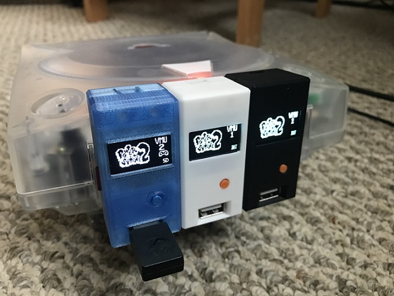
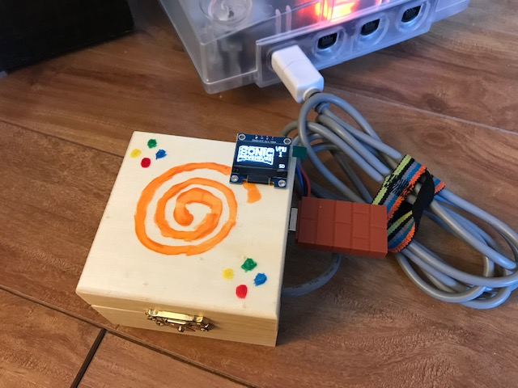
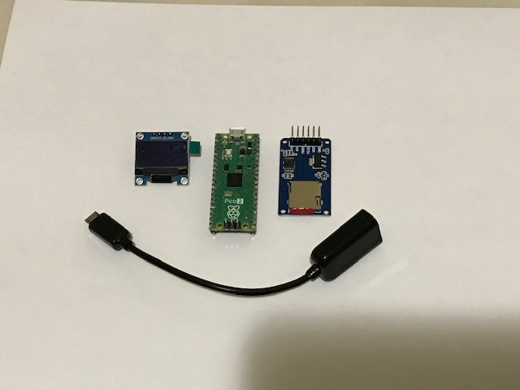
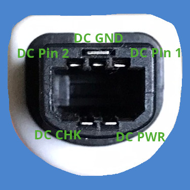
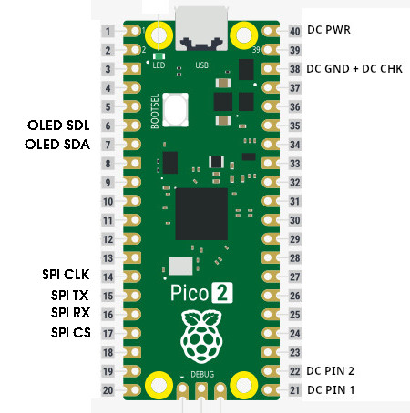

# Pico2Maple

| Example Projects           |  Connected to Dreamcast |
| :-------------------------: | :-------------------------: |
|   |   |

Pico2Maple is a Dreamcast Maple bus emulator for the RP2350. The goal of this project of to provide a way to for people to use a variety of non-Dreamcast controllers and accessories on the Sega Dreamcast.

Currently, it is possible to use several USB controllers, dongles, mice, and keyboards. Pico2Maple also integrates VMU support and saving to a microSD card.

Feel free to hop into the [Discord server](https://discord.gg/eW2u4aHR) to discuss the project, ask questions, or share your own projects using Pico2Maple.

# Download

Download the latest firmware:

* [pico2maple_2025-06-14](firmware/pico2maple_2025-05-18.uf2), USB only for Pico 2 and W boards.
* [pico2maple-w_2025-06-14](firmware/pico2maple-w_2025-05-18.uf2), USB and wireless for Pico 2 W boards.

To install the firmware on the Pico 2:

* Hold down the BOOTSEL button while connecting the Pico to a PC. This should make it appear as a USB storage device.
* Copy the pico2maple uf2 file to the Pico. It should reboot itself with the new firmware.

# Supported Controllers

For a more detailed breakdown of supported devices, please check out the [full device compatibility list](https://docs.google.com/spreadsheets/d/1B8dfP6fLWeEofmxXTmYIQBTP0vJ_oXtTCgR17ZR1jMc/edit?usp=sharing).

## USB

* Steam Controller (wireless with dongle only)
* 8BitDo Wireless Dongle (great for connecting a huge variety of other controllers)
* 8BitDo SN30 Pro Xbox Edition
* Sony DualSense 5
* XInput Controllers
* USB Keyboards
* USB Mice

## BT

Pico2Maple uses Bluepad32 to handle BT connectivity. Check out [Bluepad32 supported controller list](https://bluepad32.readthedocs.io/en/latest/supported_gamepads/) for a summary of supported devices.

The following controllers have been tested and confirmed working:

* Sony DualSense PS5 Controller
* Xbox Series Wireless Controller (3-button version)
* Nintendo WiiU Pro Controller
* 8BitDo SN30 Pro
* 8BitDo SN30 Pro Xbox Edition

# Controls

Controls are mapped as you would expect with a few extra features:

* **Select + Right Bumper/Left Bumper** switch currently-active VMU bank (cycles through 10 different VMU banks).
* **Select + A** enable standard Dreamcast controller layout.
* **Select + B** enable all controller inputs which activates the second joystick and the C,Z buttons. Z is mapped to left bumper and C to right bumper. Not all games will accept this layout. 
* **Select + X** enable Twin Stick layout. Uses both controller joysticks, bumpers and triggers.
* **Select + Y** enable Fight Stick layout. This layout remaps RB and RT inputs to the Z and C buttons respectively. LB maps to RT.

# Custom Controller Layouts/Remapping

Pico2Maple has a fairly flexible controller remapping implementation. Please check out [CONTROLLER_LAYOUTS.md](CONTROLLER_LAYOUTS.md) for full details.

# Required Hardware

* Raspberry Pi Pico 2
* Dreamcast controller cable or plug
* Micro-USB to female USB-A adapter
* Optional:
  * SPI microSD breakout board and FAT32-formatted microSD card for saving VMU data ([example](https://www.amazon.ca/dp/B0CD79YZH6))
  * SSD1306 128x64 OLED display for displaying VMU images and selected VMU bank ([example](https://www.amazon.ca/dp/B0751LFCZT))

# Construction

Use a multi-meter to check which wires on the controller cable correspond to the following pins on the controller plug.

Connect the controller wires to the labelled pins on the Pico below by soldering or otherwise.

*Optionally* connect the SPI micro-SD board and the SSD1306 OLED screen to the labelled pins on the Pico 2.

With everything wired up, it's simply a matter of plugging in a USB device to the Pico 2 using the USB-A to Mini-USB adapter and plugging the Dreamcast controller cable into the console.

# Changlog

## 2025-06-14

* Experimental support for custom controller layouts/remapping, and SD card is required to load the layout

## 2025-05-18

* Added a Fight Stick layout to accomodate typical stick layouts where the fifth and sixth buttons are RB and RT. Press Select + Y to enable. This layout remaps RB and RT inputs to the Z and C buttons on the Dreamcast respectively.

## 2025-05-13

* Implemented HID report parsing for handling a wider range of USB devices. PS3/4 controllers *may* work, give it a try
* Much improved USB mouse compatibility with proper HID parsing
* Small improvements to controller input handling

## 2025-04-09

* Wireless support for Pico2 W boards. A USB device will be used if detected, otherwise will search for a bt device.
* Refactoring of USB code

## 2025-03-03

* Add support for Twin Stick layout, press Select+X to enable
* OLED improvements
* Change VMU data location on flash storage, backup your internal VMU data before updating
* Automatically backup internal VMU data to microSD card on boot
* Additional stability improvements in preparation for bluetooth support

## 2025-02-09

* Improved stability of the Maple bus
* Additional OLED display features showing what type of device is active (controller, keyboard, or mouse)

## 2024-12-15

* Initial release

# Future Work

*Feedback on this project is very welcome!*

* Customizable controller layouts saved to microSD card (in the works)
* Rumble support for Xbox/PS controllers
* Support a wider range of USB controllers (ongoing).

# Use of Open Source Libraries

* [pico-sdk](https://github.com/raspberrypi/pico-sdk) - [BSD 3-Clause](https://github.com/raspberrypi/pico-sdk/blob/master/LICENSE.TXT)
* [tinyusb](https://github.com/hathach/tinyusb) - MIT
* [tusb_xinput](https://github.com/Ryzee119/tusb_xinput) - MIT
* [no-OS-FatFS-SD-SDIO-SPI-RPi-Pico](https://github.com/carlk3/no-OS-FatFS-SD-SDIO-SPI-RPi-Pico) - Apache 2.0
* [btstack](https://github.com/bluekitchen/btstack) - [non-commercial](https://github.com/bluekitchen/btstack/blob/master/LICENSE), [pico commercial exception](https://github.com/raspberrypi/pico-sdk/blob/master/src/rp2_common/pico_btstack/LICENSE.RP)
* [cyw43-driver](https://github.com/georgerobotics/cyw43-driver) - [License](https://github.com/georgerobotics/cyw43-driver/blob/main/LICENSE.RP)
* [bluepad32](https://github.com/ricardoquesada/bluepad32) - Apache 2.0
