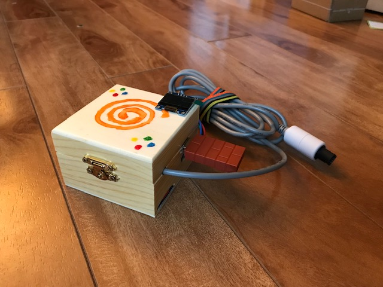

# Pico2Maple

Example Project            |  Connected to Dreamcast
:-------------------------:|:-------------------------:
  |  

Pico2Maple is a Dreamcast Maple bus emulator for the RP2350. The goal of this project of to provide a way to for people to use a variety of non-Dreamcast controllers and accessories on the Sega Dreamcast.

Currently, it is possible to use several USB controllers, dongles, mice, and keyboards. Pico2Maple also integrates VMU support and saving to a micro-SD card.

# Supported Controllers

* Steam Controller
* 8BitDo Wireless Dongle (great for connecting a huge variety of other controllers)
* USB XInput-compatible devices
* USB Keyboards
* USB Mice (scroll wheel may not work on some simple mice)

# Controls

Controls are mapped as you would expect with a few extra features:

* **Select + Right Bumper/Left Bumper** switch currently-active VMU bank (cycles through 10 different VMU banks)
* **Select + A** enable standard Dreamcast controller layout
* **Select + B** enable all controller inputs which activates the second joystick and the C,Z buttons. Z is mapped to left bumper and C to right bumper. Not all games will accept this layout. 

# Required Hardware

* Raspberry Pi Pico 2
* Micro-USB to female USB-A adapter
* Optional:
  * A SPI micro-SD breakout board for saving VMU data ([example](https://www.amazon.ca/dp/B0CD79YZH6))
  * A SSD1306 128x64 OLED display for displaying VMU images and selected VMU bank ([example](https://www.amazon.ca/dp/B0751LFCZT))

# Construction

Use a multi-meter to check which wires on the controller cable correspond to the following pins on the controller plug.

Connect the controller wires to the labelled pins on the Pico below by soldering or otherwise.

*Optionally* connect the SPI micro-SD board and the SSD1306 OLED screen to the labelled pins on the Pico 2. Taking care to connect the right Vcc voltages to the respective boards (in my case the micro-SD board needed 5V while the OLED needed 3.3V.

With everything wired up, it's simply a matter of plugging in a USB device to the Pico using the USB-A to Mini-USB adapter and plugging the controller cable into the Dreamcast.

# Libraries

* [tsub_xinput](https://github.com/Ryzee119/tusb_xinput) - MIT
* [no-OS-FatFS-SD-SDIO-SPI-RPi-Pico](https://github.com/carlk3/no-OS-FatFS-SD-SDIO-SPI-RPi-Pico) - Apache 2.0
