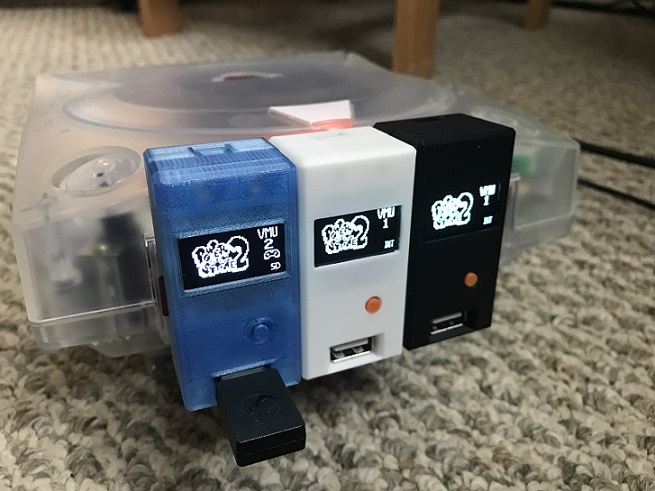
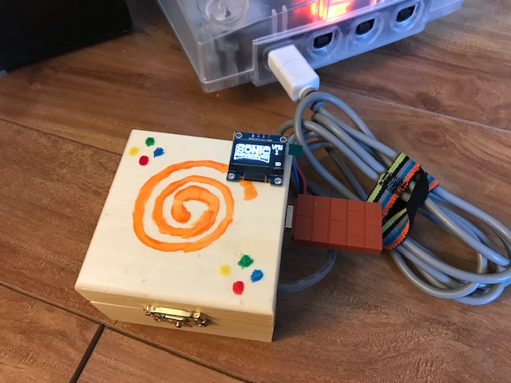
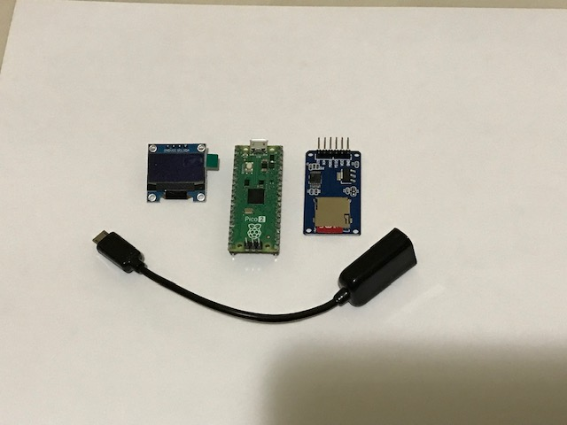
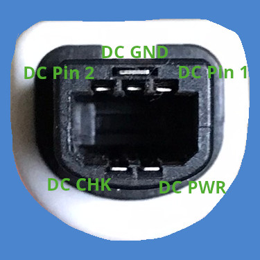
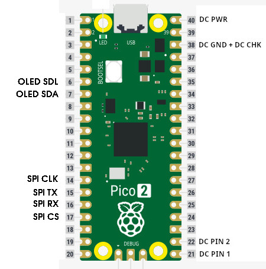

# Pico2Maple

| Example Projects           |  Connected to Dreamcast |
| :-------------------------: | :-------------------------: |
|   |   |

Pico2Maple is a Dreamcast Maple bus emulator for the RP2350/RP2040. The goal of this project of to provide a way to for people to use a variety of non-Dreamcast controllers and accessories on the Sega Dreamcast. Currently, it is possible to use several USB controllers, dongles, mice, and keyboards.

Pico2Maple also integrates VMU support with the ability to save to a microSD card. GameID is also supported with GDEMU and OpenMenu v1.2+ providing automatic switching to game-specific VMUs.

Rumble emulation is available for PS4, PS5, and Xbox controllers connected via USB or BT.

Feel free to hop into the [Discord server](https://discord.gg/MpFB7j389x) to discuss the project, ask questions, or share your own projects using Pico2Maple.

# Download

Download the latest firmware:

* [pico2maple_2026-04-05](firmware/pico2maple_2026-04-05.uf2), USB only for Pico1/2 and Pico1/2-W boards (universal RP2040/RP2350 UF2).
* [pico2maple-w_2026-04-05](firmware/pico2maple-w_2026-04-05.uf2), USB and wireless for Pico1/2-W boards (universal RP2040/RP2350 UF2).

To install the firmware on the Pico:

* Hold down the BOOTSEL button while connecting the Pico to a PC. This should make it appear as a USB storage device.
* Copy the pico2maple uf2 file to the Pico. It should reboot itself with the new firmware.

# Supported Controllers

For a more detailed breakdown of supported devices, please check out the [full device compatibility list](https://docs.google.com/spreadsheets/d/1B8dfP6fLWeEofmxXTmYIQBTP0vJ_oXtTCgR17ZR1jMc/edit?usp=sharing).

## USB

* Steam Controller (wireless with dongle only)
* Sony PlayStation DS 3/4/5 Controllers
* Nintendo Switch Pro Controller
* XInput Controllers (OG Xbox, Xbox 360, One, Series, etc.)
* 8BitDo Wireless Dongle (great for connecting a huge variety of other controllers)
* 8BitDo SN30 Pro Xbox Edition
* USB Keyboards
* USB Mice

Many generic gamepads are also supported. Please create an issue if your USB gamepad does not work.

## BT

Pico2Maple uses Bluepad32 to handle BT connectivity. Check out [Bluepad32 supported controller list](https://bluepad32.readthedocs.io/en/latest/supported_gamepads/) for a summary of supported devices.

The following controllers have been tested and confirmed working:

* Sony PlayStation DS 4/5 Controllers
* Xbox Series Wireless Controller (3-button version)
* Nintendo WiiU and Switch Pro Controllers
* 8BitDo SN30 Pro
* 8BitDo SN30 Pro Xbox Edition
* [Dreamwave Controller](https://github.com/cluoma/dreamwave)

### BT Pairing

By default, Pico2Maple boots into discoverable and pairing mode when no device is connected. Starting a sync/pairing action on a controller will initiate a connection to Pico2Maple.

Different controllers have different methods to start a sync/pairing action.

* PlayStation DS 4/5 Controllers: press and hold the PlayStation and Share buttons simultaneously until the lightbar blinks quickly.
* Xbox Series Wireless Controller: press and hold the small sync button on the front of the controller until the Xbox light blinks quickly.
* Nintendo WiiU Pro Controller: press the red sync button on the back of the controller.
* Nintendo Switch Pro Controller: press and hold the small sync button on the front of the controller until the player LEDs start blinking.

# Controls

Controls are mapped as you would expect with a few extra features:

* **Select + Right Bumper/Left Bumper** switch currently-active VMU bank (cycles through 10 different VMU banks).
* **Select + A** enable standard Dreamcast controller layout.
* **Select + B** enable all controller inputs which activates the second joystick and the C,Z buttons. Z is mapped to left bumper and C to right bumper. Not all games will accept this layout. 
* **Select + X** enable Twin Stick layout. Uses both controller joysticks, bumpers and triggers.
* **Select + Y** enable Fight Stick layout. This layout remaps RB and RT inputs to the Z and C buttons respectively. LB maps to RT.
* **Select + Dpad Right** enable a custom layout if one has been configured.
* **Select + Dpad Left** enable Racing Wheel layout. This layout will appear as an official Dreamcast Racing Wheel to games that support it.
* **Select + Dpad Down** enable/disable rumble

# Custom Controller Layouts

Pico2Maple has a fairly flexible controller remapping implementation which allows the entire controller to be reconfigured. Custom controller layouts are currently a work-in-progress and feedback is greatly appreciated.

The easiest method to create a layout is to use the [Pico2Maple Mapper tool](https://cluoma.github.io/Pico2Maple-config/). Custom layouts can then be uploaded to the device using an SD card or Raspberry Pi's [picotool](https://github.com/raspberrypi/picotool). Pre-compiled picotool binaries are [also available](https://github.com/raspberrypi/pico-sdk-tools).

Optionally, for instructions on how to manually load a custom layout from an SD card, please check out the [Controller Layouts docs](docs/controller_layouts.md). Layouts loaded from an SD card will be stored internally so only need to be loaded once.

# Per Game VMUs using GameID

Pico2Maple supports GameIDs, allowing game-specific virtual VMUs to be created and mounted automatically when launching games through the OpenMenu launcher. An SD card, GDEMU, and at least version 1.2 of [OpenMenu](https://github.com/DerekPascarella/openMenu-Virtual-Folder-Bundle) are needed to use gameID.

If an SD card is available, GameID mode can be enabled by incrementing the VMU slot past 10, or decrementing under 1, acting as sort of a separate VMU slot. The OLED will display `GID` when in GameID mode.

While in GameID mode, if a game is launched through OpenMenu, a VMU specific to that particular game will be automatically created (if it does not already exist) and loaded. The last GameID received will be saved and will be immediately re-loaded across power cycles.

GameID VMUs are stored in the `gameid` directory. These are the same as any other VMU files, and game-saves can be viewed or edited using VMU Explorer.

# Required Hardware

* Raspberry Pi Pico 1/2 (W)
* Dreamcast controller cable or plug
* Micro-USB to female USB-A adapter
* Optional:
  * SPI microSD breakout board and FAT32-formatted microSD card for saving VMU data ([example](https://www.amazon.ca/dp/B0CD79YZH6))
  * SSD1306 128x64 OLED display for displaying VMU images and selected VMU bank ([example](https://www.amazon.ca/dp/B0751LFCZT))

# Pin Layout

An alternate pin layout can be enabled by grounding GPIO15.

*Please note that pins for the CYW43 (RM2 module) are subject to change.*

| RP2040/2350 GPIO | Standard Layout        | Alternate Layout                      |
|------------------|------------------------|---------------------------------------|
| 0                | UART TX                | UART TX                               |
| 1                | UART RX                | UART RX                               |
| 2                |                        | CYW43 - gSPI DI/DO/IRQ                |
| 3                | VMU Buzzer PWM         | CYW43 - gSPI CS                       |
| 4                | OLED SDA               | OLED SDA                              |
| 5                | OLED SDL               | OLED SDL                              |
| 6                |                        | DC Maple 1                            |
| 7                |                        | DC Maple 2                            |
| 10               | microSD SPI SCK        | microSD SPI SCK                       |
| 11               | microSD SPI TX         | microSD SPI TX                        |
| 12               | microSD SPI RX         | microSD SPI RX                        |
| 13               | microSD SPI CS         | microSD SPI CS                        |
| 14               |                        | CYW43 - BT On                         |
| 15               | Internally pulled high | **Ground to enable alt layout**       |
| 16               | DC Maple 1             |                                       |
| 17               | DC Maple 2             |                                       |
| 23               | CYW43 - BT On          |                                       |
| 24               | CYW43 - gSPI DI/DO/IRQ |                                       |
| 25               | CYW43 - gSPI CS        |                                       |
| 26               |                        | VMU Buzzer PWM                        |
| 29               | CYW43 - gSPI SCLK      | CYW43 - gSPI SCLK |

# Construction

Use a multi-meter to check which wires on the controller cable correspond to the following pins on the controller plug.

Connect the controller wires to the labelled pins on the Pico below by soldering or otherwise.

*Optionally* connect the SPI micro-SD board and the SSD1306 OLED screen to the labelled pins on the Pico.

With everything wired up, it's simply a matter of plugging in a USB device to the Pico 2 using the USB-A to Mini-USB adapter and plugging the Dreamcast controller cable into the console.

# Future Work

*Feedback on this project is very welcome!*

* Improve GameID features using OLED display - show game name, manual VMU switching, etc.
* Support a wider range of USB controllers (ongoing).

# Use of Open Source Libraries

* [pico-sdk](https://github.com/raspberrypi/pico-sdk) - [BSD 3-Clause](https://github.com/raspberrypi/pico-sdk/blob/master/LICENSE.TXT)
* [tinyusb](https://github.com/hathach/tinyusb) - MIT
* [tusb_xinput](https://github.com/Ryzee119/tusb_xinput) - MIT
* [no-OS-FatFS-SD-SDIO-SPI-RPi-Pico](https://github.com/carlk3/no-OS-FatFS-SD-SDIO-SPI-RPi-Pico) - Apache 2.0
* [btstack](https://github.com/bluekitchen/btstack) - [non-commercial](https://github.com/bluekitchen/btstack/blob/master/LICENSE), [pico commercial exception](https://github.com/raspberrypi/pico-sdk/blob/master/src/rp2_common/pico_btstack/LICENSE.RP)
* [cyw43-driver](https://github.com/georgerobotics/cyw43-driver) - [License](https://github.com/georgerobotics/cyw43-driver/blob/main/LICENSE.RP)
* [bluepad32](https://github.com/ricardoquesada/bluepad32) - Apache 2.0
